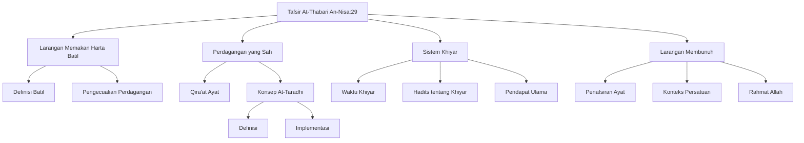

# Analisis Tafsir At-Thabari: Surat An-Nisa Ayat 29

## Abstrak

Tafsir At-Thabari menjelaskan penafsiran Surat An-Nisa ayat 29 tentang larangan memakan harta secara batil dan pembunuhan. Teks ini menguraikan syarat keabsahan transaksi perdagangan yang harus didasari kerelaan ('an taradhin) dengan pembahasan mendalam tentang konsep khiyar (hak pilih) dalam jual beli. At-Thabari mengutip berbagai riwayat dan pendapat ulama tentang batasan waktu khiyar dan implementasinya. Pembahasan dilanjutkan dengan larangan membunuh sesama muslim yang ditafsirkan dalam konteks persatuan umat, dimana membunuh sesama diibaratkan seperti membunuh diri sendiri.

## Struktur Utama

### A. Larangan Memakan Harta dengan Cara Batil

1. Definisi Batil
   - Mencakup riba
   - Judi
   - Penipuan
   - Kezaliman
2. Pengecualian
   - Transaksi perdagangan yang sah
   - Didasari kerelaan kedua pihak

### B. Konsep Perdagangan yang Didasari Kerelaan

1. Perbedaan Qira'at
   - Variasi bacaan "tijarat"
2. Interpretasi At-Taradhi
   - Definisi kerelaan dalam transaksi
   - Implementasi dalam praktik

### C. Sistem Khiyar dalam Jual Beli

1. Waktu Khiyar
   - Sebelum berpisah dari majelis
2. Riwayat Hadits
   - Berbagai hadits tentang khiyar
3. Pendapat Ulama
   - Perbedaan interpretasi batasan khiyar

### D. Larangan Membunuh

1. Penafsiran Ayat
   - Konteks membunuh diri sendiri
2. Konteks Persatuan
   - Kesatuan umat Islam
3. Rahmat Allah
   - Hikmah penetapan hukum

## Struktur CSV

```csv
Level 1,Level 2,Level 3,Keterangan
Larangan Memakan Harta Batil,Definisi Batil,,Mencakup riba judi penipuan dan kezaliman
Larangan Memakan Harta Batil,Pengecualian,Perdagangan,Transaksi yang didasari kerelaan
Perdagangan yang Sah,Qira'at Ayat,,Variasi bacaan terkait kata tijarat
Perdagangan yang Sah,Konsep At-Taradhi,Definisi,Kerelaan kedua pihak dalam transaksi
Perdagangan yang Sah,Konsep At-Taradhi,Implementasi,Penerapan dalam praktik jual beli
Sistem Khiyar,Waktu Khiyar,,Sebelum berpisah dari majelis
Sistem Khiyar,Hadits tentang Khiyar,,Riwayat-riwayat pendukung
Sistem Khiyar,Pendapat Ulama,,Perbedaan interpretasi tentang batasan khiyar
Larangan Membunuh,Penafsiran Ayat,,Konteks membunuh diri sendiri
Larangan Membunuh,Konteks Persatuan,,Kesatuan umat Islam
Larangan Membunuh,Rahmat Allah,,Hikmah penetapan hukum
```

## Diagram Pohon



## Referensi

- Sumber: Tafsir At-Thabari
- Bagian: Surat An-Nisa ayat 29
- Halaman: 625-638
