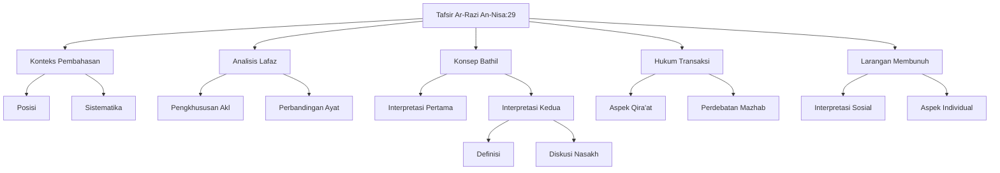

# Analisis Tafsir Ar-Razi: Surat An-Nisa Ayat 29

## Abstrak

Tafsir Ar-Razi membahas An-Nisa ayat 29 dengan pendekatan linguistik dan hukum yang mendalam. Pembahasan dimulai dari analisis kata "akl" (makan) dan konsep "bathil", dilanjutkan dengan kajian mendalam tentang aspek hukum transaksi termasuk perbedaan qira'at dan implikasi hukumnya. Ar-Razi menyajikan perdebatan antara mazhab Syafi'i dan Hanafi tentang transaksi, serta menguraikan interpretasi larangan membunuh diri dalam konteks individual dan sosial. Pembahasan diakhiri dengan penjelasan aspek rahmat dalam penetapan hukum-hukum tersebut.

## Struktur Utama

### A. Konteks dan Sistematika Pembahasan

1. Posisi Pembahasan
   - Jenis kedelapan dari pembahasan surat
   - Hubungan dengan ayat sebelumnya
2. Sistematika
   - Transisi dari harta ke jiwa
   - Korelasi dengan ayat nikah

### B. Analisis Lafaz "Akl"

1. Pengkhususan Istilah
   - Pemilihan kata makan
   - Cakupan makna yang lebih luas
2. Perbandingan Ayat
   - Kaitan dengan harta anak yatim
   - Pola penggunaan kata dalam Al-Quran

### C. Konsep "Bathil"

1. Interpretasi Pertama
   - Definisi segala yang tidak halal
   - Implikasi ke-mujmal-an ayat
2. Interpretasi Kedua
   - Harta tanpa kompensasi
   - Diskusi nasakh dan muhkam

### D. Analisis Hukum Transaksi

1. Aspek Qira'at
   - Perbedaan bacaan "tijarah"
   - Implikasi makna
2. Perdebatan Mazhab
   - Argumentasi Syafi'i
   - Pandangan Abu Hanifah

### E. Larangan Membunuh Diri

1. Interpretasi Sosial
   - Konteks kemasyarakatan
   - Kesatuan umat
2. Aspek Individual
   - Diskusi kemungkinan bunuh diri
   - Faktor pencegah

## Struktur CSV

```csv
Level 1,Level 2,Level 3,Keterangan
Konteks Pembahasan,Posisi,Jenis Kedelapan,Urutan dalam pembahasan surat
Konteks Pembahasan,Sistematika,Transisi,Hubungan antar tema ayat
Analisis Lafaz,Pengkhususan Akl,Pemilihan Istilah,Alasan penggunaan kata makan
Analisis Lafaz,Pengkhususan Akl,Cakupan Makna,Makna lebih luas dari sekedar makan
Konsep Bathil,Interpretasi Pertama,Definisi,Segala yang tidak halal dalam syariat
Konsep Bathil,Interpretasi Kedua,Definisi,Harta tanpa kompensasi
Hukum Transaksi,Aspek Qira'at,Perbedaan,Variasi bacaan tijarah
Hukum Transaksi,Perdebatan Mazhab,Argumentasi,Perbedaan Syafi'i dan Hanafi
Larangan Membunuh,Interpretasi Sosial,Konteks,Makna dalam konteks masyarakat
Larangan Membunuh,Aspek Individual,Analisis,Diskusi tentang bunuh diri
```

## Diagram Pohon



## Referensi

- Sumber: Tafsir ar-Razi (Mafatih al-Ghaib)
- Bagian: Surat An-Nisa ayat 29
- Halaman: 71-74
