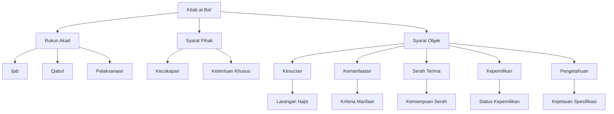

# Analisis Minhaj at-Thalibin: Kitab al-Bai' (Jual Beli)

## Abstrak

Imam Nawawi dalam Minhaj at-Thalibin menyajikan pembahasan sistematis tentang jual beli, dimulai dari rukun akad berupa ijab-qabul beserta syarat-syaratnya. Teks menguraikan lima syarat utama objek jual beli: kesucian, kemanfaatan, kemampuan serah terima, kepemilikan, dan pengetahuan tentang objek. Setiap syarat dibahas secara terperinci dengan berbagai kasus dan pengecualian. Pembahasan mencakup aspek praktis seperti jual beli barang tidak terlihat dan ketentuan khusus untuk kasus-kasus tertentu.

## Struktur Utama

### A. Rukun Akad Jual Beli

1. Ijab (Penawaran)
   - Contoh lafaz: bi'tuka, mallaktuka
   - Boleh mendahulukan lafaz pembeli
2. Qabul (Penerimaan)
   - Contoh lafaz: isytaraitu, tamallaktu
   - Harus sesuai dengan ijab
3. Syarat Pelaksanaan
   - Tidak ada jeda panjang
   - Kesesuaian ijab-qabul
   - Isyarat orang bisu setara ucapan

### B. Syarat Para Pihak

1. Kecakapan
   - Rusyd (kedewasaan dan kecakapan)
   - Tidak ada paksaan
2. Ketentuan Khusus
   - Larangan non-muslim membeli mushaf
   - Larangan harbiy membeli senjata

### C. Syarat Objek Jual Beli

1. Kesucian
   - Larangan benda najis
   - Kasus minyak najis
2. Kemanfaatan
   - Kriteria manfaat
   - Pengecualian air dan tanah
3. Kemampuan Serah Terima
   - Larangan barang hilang
   - Kasus barang gadai
4. Kepemilikan
   - Status jual beli fudhuli
   - Kasus harta warisan
5. Pengetahuan Objek
   - Kejelasan spesifikasi
   - Ketentuan barang tidak terlihat

## Struktur CSV

```csv
Level 1,Level 2,Level 3,Keterangan
Rukun Akad,Ijab,Lafaz,Contoh bi'tuka mallaktuka
Rukun Akad,Qabul,Lafaz,Contoh isytaraitu tamallaktu
Rukun Akad,Pelaksanaan,Syarat,Tidak ada jeda panjang
Syarat Pihak,Kecakapan,Rusyd,Kedewasaan dan kemampuan
Syarat Pihak,Ketentuan Khusus,Non-Muslim,Larangan beli mushaf
Syarat Objek,Kesucian,Larangan,Benda najis
Syarat Objek,Kemanfaatan,Kriteria,Harus bermanfaat
Syarat Objek,Serah Terima,Kemampuan,Harus dapat diserahkan
Syarat Objek,Kepemilikan,Status,Harus dimiliki penjual
Syarat Objek,Pengetahuan,Kejelasan,Spesifikasi harus jelas
```

## Diagram Pohon



## Referensi

- Sumber: Minhaj at-Thalibin wa 'Umdat al-Muftin
- Penulis: Imam an-Nawawi
- Bagian: Kitab al-Bai' (Jual Beli)
- Halaman: 210-212
