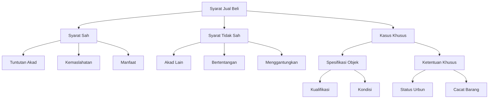

# Analisis al-Muqni': Bab Syarat-syarat Jual Beli

## Abstrak

Ibnu Qudamah dalam al-Muqni' membahas syarat-syarat jual beli dengan membaginya menjadi dua kategori utama: syarat sah dan tidak sah. Setiap kategori dirinci menjadi tiga jenis dengan penjelasan dan contoh spesifik. Pembahasan mencakup syarat yang menjadi tuntutan akad, syarat kemaslahatan, dan syarat manfaat tambahan untuk syarat sah, serta syarat akad lain, syarat yang bertentangan, dan syarat yang menggantungkan untuk syarat tidak sah. Teks juga memuat berbagai kasus khusus seperti jual beli urbun dan spesifikasi objek jual beli.

## Struktur Utama

### A. Syarat Sah (Syuruth Shahih)

1. Syarat Tuntutan Akad
   - Serah terima
   - Pembayaran tunai
   - Ketentuan dasar akad

2. Syarat Kemaslahatan
   - Spesifikasi pembayaran
   - Spesifikasi objek
   - Jaminan dan penanggung

3. Syarat Manfaat Tertentu
   - Pemanfaatan temporer
   - Jasa tambahan
   - Batasan kombinasi syarat

### B. Syarat Tidak Sah (Syuruth Fasid)

1. Mensyaratkan Akad Lain
   - Pinjaman
   - Sewa
   - Pertukaran mata uang

2. Syarat Bertentangan
   - Penafian kerugian
   - Pembatasan disposisi
   - Syarat pembebasan

3. Syarat Menggantungkan
   - Persetujuan pihak ketiga
   - Ketentuan waktu
   - Kasus urbun

### C. Kasus-kasus Khusus

1. Spesifikasi Objek
   - Kualifikasi budak
   - Kondisi hewan
   - Perbedaan ukuran

2. Ketentuan Khusus
   - Status urbun
   - Cacat barang
   - Perbedaan ukuran

## Struktur CSV

```csv
Level 1,Level 2,Level 3,Keterangan
Syarat Sah,Tuntutan Akad,Serah Terima,Ketentuan dasar transaksi
Syarat Sah,Kemaslahatan,Spesifikasi,Ketentuan objek dan pembayaran
Syarat Sah,Manfaat,Pemanfaatan,Penggunaan temporer objek
Syarat Tidak Sah,Akad Lain,Pinjaman,Kombinasi dengan akad lain
Syarat Tidak Sah,Bertentangan,Pembatasan,Syarat yang menafikan akad
Syarat Tidak Sah,Menggantungkan,Ketentuan,Syarat yang menangguhkan
Kasus Khusus,Spesifikasi,Kualifikasi,Ketentuan spesifik objek
Kasus Khusus,Ketentuan,Status Urbun,Aturan uang muka
```

## Diagram Pohon



## Referensi

- Sumber: al-Muqni' fi Fiqh al-Imam Ahmad ibn Hanbal
- Penulis: Ibn Qudamah
- Bagian: Kitab al-Bai', Bab Syuruth fi al-Bai'
- Halaman: 157-158
