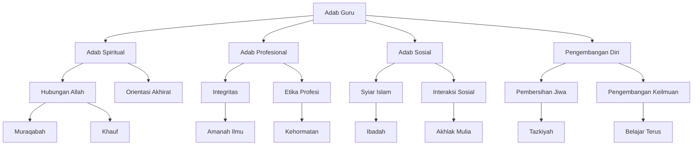

# Analisis Adab al-'Alim wa al-Muta'allim: Bab Adab Guru

## Abstrak

Kitab Adab al-'Alim wa al-Muta'allim karya KH. Hasyim Asy'ari membahas dua puluh adab yang harus dimiliki seorang guru terhadap dirinya sendiri. Pembahasan mencakup aspek spiritual seperti muraqabah dan khusyuk, aspek profesional seperti menjaga marwah keilmuan, aspek sosial seperti menegakkan syiar Islam, dan aspek pengembangan diri seperti pembersihan akhlak dan pengembangan keilmuan. Teks menekankan pentingnya keseimbangan antara dimensi internal (pembentukan karakter) dan eksternal (perilaku sosial) dalam pribadi seorang guru.

## Struktur Utama

### A. Adab Spiritual

1. Hubungan dengan Allah
   - Muraqabah terus-menerus
   - Khauf (takut kepada Allah)
   - Sakinah (ketenangan)
   - Tawadhu (rendah hati)
   - Khusyuk

2. Orientasi Akhirat
   - Tawakal kepada Allah
   - Zuhud terhadap dunia
   - Menjaga amanah ilmu

### B. Adab Profesional

1. Integritas Keilmuan
   - Tidak menjadikan ilmu untuk dunia
   - Menghindari kepentingan material
   - Menjaga marwah keilmuan

2. Etika Profesi
   - Menghindari profesi rendah
   - Menjaga kehormatan ilmu
   - Menghindari tempat mencurigakan

### C. Adab Sosial

1. Syiar Islam
   - Menegakkan ibadah
   - Menghidupkan sunnah
   - Amar ma'ruf nahi munkar

2. Interaksi Sosial
   - Akhlak mulia kepada sesama
   - Lemah lembut kepada murid
   - Membantu yang membutuhkan

### D. Pengembangan Diri

1. Pembersihan Jiwa
   - Menghindari akhlak tercela
   - Menghiasi diri dengan akhlak mulia
   - Menjaga hati dari sifat buruk

2. Pengembangan Keilmuan
   - Terus belajar
   - Tidak malu belajar dari siapapun
   - Menulis dan mengarang

## Struktur CSV

```csv
Level 1,Level 2,Level 3,Keterangan
Adab Spiritual,Hubungan Allah,Muraqabah,Pengawasan diri terus-menerus
Adab Spiritual,Hubungan Allah,Khauf,Rasa takut kepada Allah
Adab Spiritual,Orientasi Akhirat,Tawakal,Berserah kepada Allah
Adab Spiritual,Orientasi Akhirat,Zuhud,Tidak cinta dunia
Adab Profesional,Integritas,Amanah Ilmu,Menjaga kesucian ilmu
Adab Profesional,Etika Profesi,Kehormatan,Menjaga marwah keilmuan
Adab Sosial,Syiar Islam,Ibadah,Menegakkan syiar agama
Adab Sosial,Interaksi,Akhlak Mulia,Hubungan dengan sesama
Pengembangan Diri,Pembersihan Jiwa,Tazkiyah,Membersihkan akhlak tercela
Pengembangan Diri,Keilmuan,Belajar,Pengembangan ilmu berkelanjutan
```

## Diagram Pohon



## Referensi

- Sumber: Adab al-'Alim wa al-Muta'allim
- Penulis: KH. Hasyim Asy'ari
- Bagian: Bab Kelima - Adab Guru Terhadap Dirinya
- Halaman: 55-95
