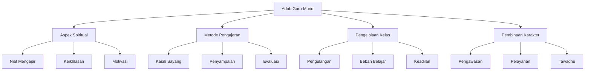

# Analisis Tadzkirat al-Sami': Adab Guru Terhadap Murid

## Abstrak

Ibnu Jama'ah dalam Tadzkirat al-Sami' menguraikan empat belas adab yang harus dimiliki seorang guru dalam berinteraksi dengan muridnya. Pembahasan dimulai dari niat mengajar yang harus ikhlas untuk Allah, metode pengajaran yang efektif, hingga aspek-aspek psikologis dalam interaksi guru-murid. Teks memberikan perhatian khusus pada pentingnya pembentukan karakter, pemahaman individual murid, dan pengembangan potensi mereka dengan pendekatan yang penuh hikmah dan bertahap.

## Struktur Utama

### A. Aspek Spiritual dan Niat (1-3)

1. Niat Mengajar
   - Mengharap ridha Allah
   - Menyebarkan ilmu
   - Menghidupkan syariat

2. Keikhlasan dalam Mendidik
   - Tidak menolak murid yang niatnya belum murni
   - Membimbing secara bertahap

3. Motivasi Belajar
   - Menjelaskan keutamaan ilmu
   - Mendorong kesederhanaan hidup

### B. Metode Pengajaran (4-7)

1. Kasih Sayang dalam Mengajar
   - Memperlakukan murid seperti anak sendiri
   - Sabar menghadapi kekurangan

2. Metode Penyampaian
   - Kemudahan dalam menjelaskan
   - Bertahap dalam pembelajaran

3. Evaluasi Pemahaman
   - Memberikan pertanyaan
   - Mengulang penjelasan

4. Pengaturan Materi
   - Sesuai kemampuan murid
   - Sistematis dalam penyampaian

### C. Pengelolaan Kelas (8-11)

1. Evaluasi dan Pengulangan
   - Menguji hafalan
   - Mengecek pemahaman

2. Pengaturan Beban Belajar
   - Memperhatikan kemampuan individual
   - Mencegah kejenuhan

3. Penyampaian Kaidah
   - Penjelasan prinsip dasar
   - Contoh-contoh penerapan

4. Keadilan dalam Mengajar
   - Tidak membeda-bedakan murid
   - Pengaturan giliran belajar

### D. Pembinaan Karakter (12-14)

1. Pengawasan Perilaku
   - Monitoring akhlak
   - Koreksi bertahap

2. Pelayanan dan Perhatian
   - Membantu kesulitan murid
   - Menjalin silaturahmi

3. Tawadhu dan Kelembutan
   - Rendah hati kepada murid
   - Ramah dalam interaksi

## Struktur CSV

```csv
Level 1,Level 2,Level 3,Keterangan
Aspek Spiritual,Niat Mengajar,Keikhlasan,Mengharap ridha Allah
Aspek Spiritual,Keikhlasan,Penerimaan Murid,Tidak menolak murid
Aspek Spiritual,Motivasi,Dorongan,Menjelaskan keutamaan ilmu
Metode Pengajaran,Kasih Sayang,Perlakuan,Seperti anak sendiri
Metode Pengajaran,Penyampaian,Kemudahan,Penjelasan bertahap
Metode Pengajaran,Evaluasi,Pengecekan,Memberikan pertanyaan
Pengelolaan Kelas,Evaluasi,Hafalan,Mengecek pemahaman
Pengelolaan Kelas,Beban Belajar,Pengaturan,Sesuai kemampuan
Pengelolaan Kelas,Keadilan,Perlakuan,Tidak diskriminatif
Pembinaan Karakter,Pengawasan,Monitoring,Akhlak dan perilaku
Pembinaan Karakter,Pelayanan,Perhatian,Membantu kesulitan
Pembinaan Karakter,Tawadhu,Interaksi,Rendah hati dan ramah
```

## Diagram Pohon



## Referensi

- Sumber: Tadzkirat al-Sami' wa al-Mutakallim fi Adab al-'Alim wa al-Muta'allim
- Penulis: Ibn Jama'ah
- Bagian: Fasl al-Thalith - Fi Adab al-'Alim ma'a Talabatihi
