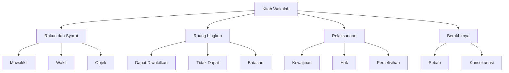

# Analisis Minhaj at-Thalibin: Kitab al-Wakalah

## Abstrak

Imam Nawawi dalam Kitab al-Wakalah membahas secara komprehensif tentang konsep perwakilan dalam hukum Islam. Pembahasan mencakup syarat-syarat pemberi kuasa (muwakkil), penerima kuasa (wakil), dan objek yang diwakilkan. Teks menguraikan berbagai bentuk transaksi yang bisa diwakilkan, batasan-batasan wakil dalam bertindak, serta hal-hal yang dapat membatalkan akad wakalah. Perhatian khusus diberikan pada aspek pelanggaran mandat dan penyelesaian perselisihan antara muwakkil dan wakil.

## Struktur Utama

### A. Rukun dan Syarat Wakalah

1. Syarat Muwakkil
   - Kecakapan melakukan tindakan
   - Kepemilikan atau kewenangan
   - Pengecualian untuk kasus tertentu

2. Syarat Wakil
   - Kecakapan bertindak
   - Ketentuan khusus
   - Batasan kewenangan

3. Syarat Objek Wakalah
   - Kepemilikan muwakkil
   - Dapat diwakilkan
   - Harus diketahui

### B. Ruang Lingkup Wakalah

1. Transaksi yang Dapat Diwakilkan
   - Jual beli
   - Pernikahan
   - Pembayaran hutang
   - Litigasi

2. Transaksi yang Tidak Dapat Diwakilkan
   - Ibadah pribadi
   - Sumpah
   - Pengakuan
   - Kesaksian

3. Batasan Kewenangan
   - Ketentuan harga
   - Syarat pembayaran
   - Spesifikasi barang

### C. Pelaksanaan Wakalah

1. Kewajiban Wakil
   - Mematuhi batasan
   - Bertindak untuk kepentingan muwakkil
   - Menjaga amanah

2. Hak-hak Wakil
   - Penerimaan upah
   - Pembebasan tanggung jawab
   - Penggantian kerugian

3. Perselisihan
   - Perbedaan klaim
   - Pembuktian
   - Penyelesaian

### D. Berakhirnya Wakalah

1. Sebab-sebab Berakhir
   - Pembatalan
   - Kematian
   - Hilang kecakapan
   - Selesainya tugas

2. Konsekuensi Hukum
   - Pertanggungjawaban
   - Penyelesaian hak
   - Kewajiban para pihak

## Struktur CSV

```csv
Level 1,Level 2,Level 3,Keterangan
Rukun Wakalah,Muwakkil,Kecakapan,Syarat pemberi kuasa
Rukun Wakalah,Wakil,Kecakapan,Syarat penerima kuasa
Rukun Wakalah,Objek,Ketentuan,Syarat yang diwakilkan
Ruang Lingkup,Dapat Diwakilkan,Transaksi,Jenis akad yang boleh
Ruang Lingkup,Tidak Dapat,Ibadah,Jenis yang tidak boleh
Pelaksanaan,Kewajiban,Kepatuhan,Tugas wakil
Pelaksanaan,Hak,Kompensasi,Hak wakil
Berakhirnya,Sebab,Pembatalan,Penyebab berakhir
Berakhirnya,Konsekuensi,Tanggung Jawab,Akibat hukum
```

## Diagram Pohon



## Referensi

- Sumber: Minhaj at-Thalibin wa 'Umdat al-Muftin
- Penulis: Imam an-Nawawi
- Bagian: Kitab al-Wakalah
- Halaman: 272-278
