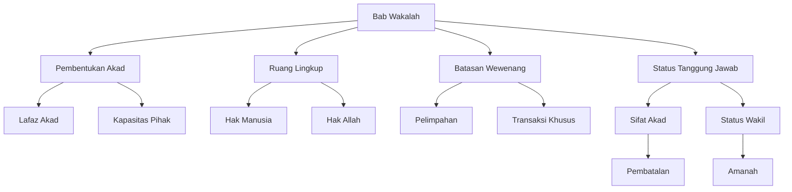

# Analisis al-Muqni': Bab Wakalah (Perwakilan)

## Abstrak

Ibnu Qudamah dalam Bab Wakalah membahas konsep perwakilan menurut mazhab Hanbali. Pembahasan dimulai dari syarat akad wakalah, ruang lingkup yang dapat diwakilkan, hingga status hukum wakil sebagai pemegang amanah. Teks memberikan perhatian khusus pada aspek-aspek praktis seperti mekanisme pengangkatan wakil, batasan-batasan tindakan wakil, dan penyelesaian perselisihan. Pendekatan yang digunakan menunjukkan fleksibilitas mazhab Hanbali dalam merespon kebutuhan praktis masyarakat.

## Struktur Utama

### A. Pembentukan Akad Wakalah

1. Lafaz Akad
   - Bentuk pengungkapan izin
   - Bentuk penerimaan
   - Waktu pelaksanaan

2. Kapasitas Para Pihak
   - Syarat pemberi kuasa
   - Syarat penerima kuasa
   - Ketentuan khusus

### B. Ruang Lingkup Wakalah

1. Hak-hak Manusia
   - Akad dan pembatalan
   - Pernikahan dan perceraian
   - Kepemilikan harta

2. Hak-hak Allah
   - Ibadah yang dapat diwakilkan
   - Pelaksanaan hukuman
   - Pengecualian

### C. Batasan dan Wewenang

1. Pelimpahan Wewenang
   - Syarat sub-perwakilan
   - Ketentuan khusus
   - Pembatasan tindakan

2. Transaksi Khusus
   - Jual beli
   - Penerimaan pembayaran
   - Penyelesaian hutang

### D. Status dan Tanggung Jawab

1. Sifat Akad
   - Akad yang dapat dibatalkan
   - Sebab-sebab berakhir
   - Konsekuensi pembatalan

2. Status Wakil
   - Posisi sebagai amanah
   - Pertanggungjawaban
   - Penyelesaian sengketa

## Struktur CSV

```csv
Level 1,Level 2,Level 3,Keterangan
Pembentukan Akad,Lafaz,Izin,Bentuk pemberian kuasa
Pembentukan Akad,Lafaz,Penerimaan,Bentuk persetujuan
Pembentukan Akad,Kapasitas,Syarat,Kelayakan pihak
Ruang Lingkup,Hak Manusia,Transaksi,Hal yang dapat diwakilkan
Ruang Lingkup,Hak Allah,Ibadah,Batasan perwakilan
Batasan Wewenang,Pelimpahan,Sub-wakil,Ketentuan pelimpahan
Batasan Wewenang,Transaksi,Jual Beli,Aturan khusus
Status Tanggung Jawab,Sifat Akad,Pembatalan,Ketentuan berakhir
Status Tanggung Jawab,Status Wakil,Amanah,Pertanggungjawaban
```

## Diagram Pohon



## Referensi

- Sumber: al-Muqni' fi Fiqh al-Imam Ahmad ibn Hanbal
- Penulis: Ibn Qudamah
- Bagian: Kitab al-Hajr, Bab Wakalah
- Halaman: 191-194
