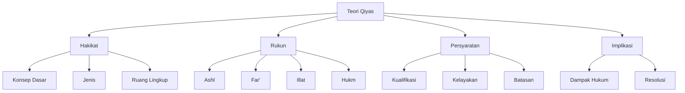

# Analisis al-Bayan al-Mullama': Pembahasan Qiyas

## Abstrak

Teks al-Bayan al-Mullama' membahas secara mendalam tentang konsep qiyas (analogi) dalam metodologi hukum Islam. Pembahasan mencakup definisi qiyas, jenis-jenisnya, rukun-rukunnya (ashl, far', 'illat, dan hukm), serta syarat-syarat penggunaannya. Penekanan khusus diberikan pada pembahasan tentang 'illat (alasan hukum) dan berbagai aspeknya, termasuk cara-cara menentukannya dan batasan-batasan penggunaannya. Teks juga memuat diskusi tentang perbedaan pendapat ulama dalam berbagai aspek qiyas.

## Struktur Utama

### A. Hakikat dan Definisi Qiyas

1. Konsep Dasar
   - Pembawa hukum ke kasus baru
   - Perbandingan dengan metodologi lain
   - Ruang lingkup penggunaan

2. Jenis-jenis Qiyas
   - Qiyas 'illat
   - Qiyas dalalah
   - Qiyas syabah

### B. Rukun-rukun Qiyas

1. Al-Ashl (Kasus Asal)
   - Sumber penetapan
   - Syarat-syarat ashl
   - Batasan penggunaan

2. Al-Far' (Kasus Cabang)
   - Kriteria kasus baru
   - Hubungan dengan ashl
   - Mekanisme penerapan

3. Al-'Illat (Alasan Hukum)
   - Definisi dan jenis
   - Cara penetapan
   - Syarat-syarat 'illat

4. Al-Hukm (Ketentuan Hukum)
   - Jenis hukum
   - Mekanisme transfer
   - Batasan penerapan

### C. Persyaratan dan Batasan

1. Syarat Penggunaan
   - Kualifikasi mujtahid
   - Kelayakan kasus
   - Metode verifikasi

2. Batasan Penerapan
   - Area yang tidak boleh di-qiyas
   - Pengecualian khusus
   - Pertimbangan maslahah

### D. Implikasi dan Aplikasi

1. Dampak Hukum
   - Status hasil qiyas
   - Hierarki kekuatan
   - Penggunaan praktis

2. Perbedaan Pendapat
   - Argumentasi ulama
   - Resolusi konflik
   - Preferensi pendapat

## Struktur CSV

```csv
Level 1,Level 2,Level 3,Keterangan
Hakikat Qiyas,Konsep Dasar,Definisi,Pengertian fundamental
Hakikat Qiyas,Jenis,Pembagian,Tiga jenis utama
Hakikat Qiyas,Ruang Lingkup,Cakupan,Area penggunaan
Rukun Qiyas,Ashl,Sumber,Kasus original
Rukun Qiyas,Far',Aplikasi,Kasus baru
Rukun Qiyas,Illat,Alasan,Sebab hukum
Rukun Qiyas,Hukm,Ketentuan,Hasil penerapan
Persyaratan,Mujtahid,Kualifikasi,Syarat pelaku
Persyaratan,Kasus,Kelayakan,Kriteria masalah
Implikasi,Dampak,Status,Kekuatan hukum
Implikasi,Perbedaan,Resolusi,Penyelesaian konflik
```

## Diagram Pohon



## Referensi

- Sumber: al-Bayan al-Mullama'
- Penulis: KH. Muhammad Sahal Mahfudh
- Bagian: Pembahasan Qiyas
- Halaman: 155-175
