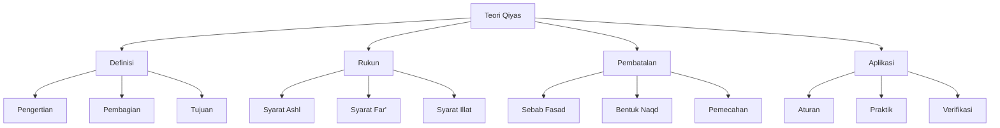

# Analisis Syarah al-Waraqat: Pembahasan Qiyas

## Abstrak

Imam al-Mahalli dalam Syarah al-Waraqat memberikan penjelasan sistematis tentang qiyas sebagai sumber hukum Islam. Pembahasan mencakup definisi, pembagian qiyas menjadi tiga jenis (qiyas 'illat, qiyas dalalah, dan qiyas syabah), syarat-syarat rukun qiyas, serta pembatalan qiyas (fasad al-qiyas). Teks menunjukkan pendekatan metodologis yang ketat dalam penggunaan qiyas sebagai alat penetapan hukum.

## Struktur Utama

### A. Definisi dan Pembagian

1. Pengertian Qiyas
   - Mengembalikan cabang ke asal
   - Kesamaan 'illat
   - Tujuan penerapan

2. Jenis-jenis Qiyas
   - Qiyas 'illat (sebab pasti)
   - Qiyas dalalah (petunjuk)
   - Qiyas syabah (kemiripan)

### B. Rukun dan Syarat

1. Syarat Al-Ashl
   - Hukum harus syar'i
   - Dalil harus disepakati
   - Tidak mansukh

2. Syarat Al-Far'
   - Kesesuaian dengan ashl
   - Keberadaan 'illat
   - Tidak ada nash khusus

3. Syarat Al-'Illat
   - Konsistensi (ittirād)
   - Tidak terbantah
   - Kesesuaian hukum

### C. Pembatalan Qiyas

1. Sebab-sebab Fasad
   - Bertentangan dengan nash
   - Bertentangan dengan ijma'
   - Tidak adanya 'illat

2. Bentuk Pembatalan
   - Naqd (kontradiksi)
   - 'Aks (pembalikan)
   - Farq (pembedaan)

### D. Aplikasi dan Ketentuan

1. Aturan Penggunaan
   - Prioritas dalil
   - Batasan penerapan
   - Resolusi konflik

2. Penerapan Praktis
   - Contoh-contoh valid
   - Kasus pengecualian
   - Metodologi verifikasi

## Struktur CSV

```csv
Level 1,Level 2,Level 3,Keterangan
Definisi,Pengertian,Dasar,Mengembalikan cabang ke asal
Definisi,Pembagian,Jenis,Tiga tipe qiyas
Definisi,Tujuan,Fungsi,Penetapan hukum baru
Rukun,Ashl,Syarat,Ketentuan kasus asal
Rukun,Far',Ketentuan,Syarat kasus cabang
Rukun,Illat,Persyaratan,Kriteria alasan hukum
Pembatalan,Sebab,Fasad,Penyebab tidak valid
Pembatalan,Bentuk,Naqd,Jenis pembatalan
Aplikasi,Penggunaan,Aturan,Metodologi penerapan
Aplikasi,Praktik,Contoh,Implementasi nyata
```

## Diagram Pohon



## Referensi

- Sumber: Syarah al-Waraqat
- Penulis: Imam Jalaluddin al-Mahalli
- Bagian: Pembahasan Qiyas
- Halaman: 131-136
