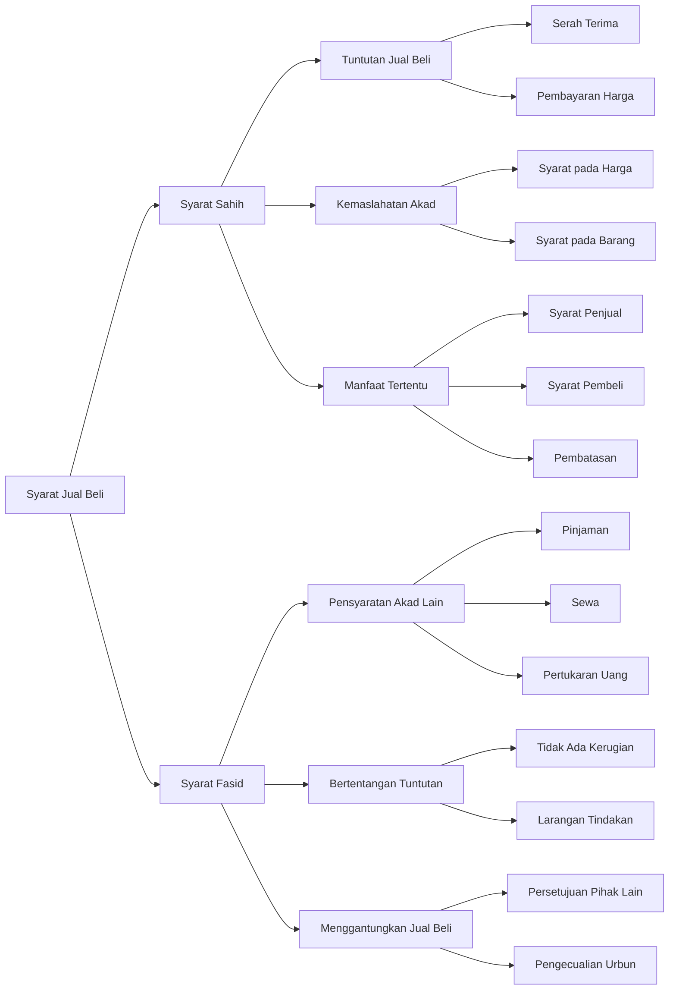

# Al Muqni - Jual Beli

## Diagram

## Tabel

| Level 1      | Level 2                  | Level 3                | Keterangan                               |
|--------------|--------------------------|------------------------|------------------------------------------|
| Syarat Sahih | Tuntutan Jual Beli       | Serah Terima           | Merupakan konsekuensi akad               |
| Syarat Sahih | Tuntutan Jual Beli       | Pembayaran Harga       | Merupakan konsekuensi akad               |
| Syarat Sahih | Kemaslahatan Akad        | Syarat pada Harga      | Penundaan pembayaran gadai jaminan       |
| Syarat Sahih | Kemaslahatan Akad        | Syarat pada Barang     | Spesifikasi seperti budak pekerja Muslim |
| Syarat Sahih | Manfaat Tertentu         | Syarat Penjual         | Menempati rumah sebulan                  |
| Syarat Sahih | Manfaat Tertentu         | Syarat Pembeli         | Mengangkut kayu                          |
| Syarat Sahih | Manfaat Tertentu         | Pembatasan             | Tidak boleh dua syarat sekaligus         |
| Syarat Fasid | Pensyaratan Akad Lain    | Pinjaman               | Membatalkan jual beli                    |
| Syarat Fasid | Pensyaratan Akad Lain    | Sewa                   | Membatalkan jual beli                    |
| Syarat Fasid | Pensyaratan Akad Lain    | Pertukaran Uang        | Membatalkan jual beli                    |
| Syarat Fasid | Bertentangan Tuntutan    | Tidak Ada Kerugian     | Syarat yang merusak                      |
| Syarat Fasid | Bertentangan Tuntutan    | Larangan Tindakan      | Tidak boleh jual hibah merdeka           |
| Syarat Fasid | Menggantungkan Jual Beli | Persetujuan Pihak Lain | Jual beli tergantung persetujuan         |
| Syarat Fasid | Menggantungkan Jual Beli | Pengecualian           | Boleh dalam jual beli urbun              |

## Syarat-syarat dalam Jual Beli menurut Kitab al-Muqni'

Kitab al-Muqni' membagi syarat dalam jual beli menjadi dua kategori utama: syarat sahih (benar) dan syarat fasid (rusak).

### Syarat Sahih

Syarat sahih terbagi menjadi tiga jenis:

#### 1. Tuntutan Jual Beli

Merupakan syarat yang menjadi konsekuensi dari akad jual beli itu sendiri, seperti:

- Serah terima barang
- Pembayaran harga

#### 2. Kemaslahatan Akad

Syarat yang bertujuan untuk kemaslahatan akad, meliputi:

- Pensyaratan pada harga: seperti penundaan pembayaran, gadai, atau jaminan
- Pensyaratan pada barang: seperti spesifikasi budak yang bisa bekerja atau Muslim

#### 3. Manfaat Tertentu

Mencakup manfaat yang disyaratkan oleh penjual atau pembeli:

- Syarat penjual: seperti menempati rumah selama sebulan
- Syarat pembeli: seperti mengangkut kayu
- Pembatasan: tidak boleh menggabungkan dua syarat sekaligus

### Syarat Fasid

Syarat fasid juga terbagi menjadi tiga jenis:

#### 1. Pensyaratan Akad Lain

Mensyaratkan adanya akad lain dalam jual beli, seperti:

- Pinjaman
- Sewa
- Pertukaran uang

#### 2. Bertentangan dengan Tuntutan Jual Beli

Syarat yang bertentangan dengan hakikat jual beli:

- Syarat tidak ada kerugian
- Larangan untuk menjual, menghibahkan, atau memerdekakan

#### 3. Menggantungkan Jual Beli

Syarat yang membuat jual beli tergantung pada sesuatu:

- Persetujuan pihak lain
- Pengecualian pada jual beli urbun (uang muka)
