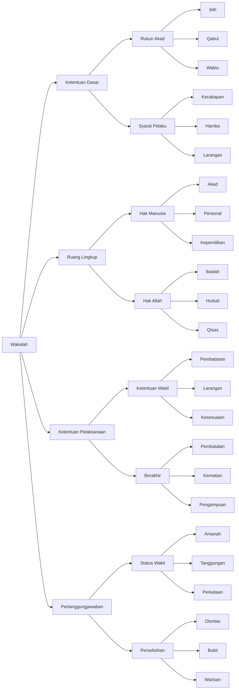

# Al Muqni Wakalah

## Diagram

## Tabel

| Level 1               | Level 2         | Level 3     | Keterangan                                   |
|-----------------------|-----------------|-------------|----------------------------------------------|
| Ketentuan Dasar       | Rukun Akad      | Ijab        | Ucapan yang menunjukkan izin                 |
| Ketentuan Dasar       | Rukun Akad      | Qabul       | Ucapan/perbuatan yang menunjukkan penerimaan |
| Ketentuan Dasar       | Rukun Akad      | Waktu       | Boleh langsung atau ditunda                  |
| Ketentuan Dasar       | Syarat Pelaku   | Kecakapan   | Harus memiliki kecakapan bertindak           |
| Ketentuan Dasar       | Syarat Pelaku   | Hamba       | Boleh dengan izin tuan                       |
| Ketentuan Dasar       | Syarat Pelaku   | Larangan    | Tidak boleh tanpa izin                       |
| Ruang Lingkup         | Hak Manusia     | Akad        | Akad dan pembatalan                          |
| Ruang Lingkup         | Hak Manusia     | Personal    | Pembebasan budak dan talak                   |
| Ruang Lingkup         | Hak Manusia     | Kepemilikan | Hal yang mubah                               |
| Ruang Lingkup         | Hak Allah       | Ibadah      | Yang bisa diwakilkan                         |
| Ruang Lingkup         | Hak Allah       | Hudud       | Penetapan dan pelaksanaan                    |
| Ruang Lingkup         | Hak Allah       | Qisas       | Dengan syarat khusus                         |
| Ketentuan Pelaksanaan | Ketentuan Wakil | Pembatasan  | Tidak boleh mewakilkan tanpa izin            |
| Ketentuan Pelaksanaan | Ketentuan Wakil | Larangan    | Tidak boleh jual beli untuk diri             |
| Ketentuan Pelaksanaan | Ketentuan Wakil | Kesesuaian  | Harus sesuai ketentuan                       |
| Ketentuan Pelaksanaan | Berakhir        | Pembatalan  | Dari kedua pihak                             |
| Ketentuan Pelaksanaan | Berakhir        | Kematian    | Kematian dan gila                            |
| Ketentuan Pelaksanaan | Berakhir        | Pengampuan  | Status safih                                 |
| Pertanggungjawaban    | Status Wakil    | Amanah      | Sebagai pemegang amanah                      |
| Pertanggungjawaban    | Status Wakil    | Tanggungan  | Tidak menanggung tanpa lalai                 |
| Pertanggungjawaban    | Status Wakil    | Perkataan   | Diterima dengan sumpah                       |
| Pertanggungjawaban    | Perselisihan    | Otoritas    | Perkataan muwakkil diterima                  |
| Pertanggungjawaban    | Perselisihan    | Bukti       | Perlu bukti dalam klaim                      |
| Pertanggungjawaban    | Perselisihan    | Warisan     | Ketentuan khusus waris                       |

## Konsep Wakalah dalam Kitab al-Muqni'

### Ketentuan Dasar

#### 1. Rukun Akad

Wakalah menjadi sah dengan:

- Ijab: Ucapan yang menunjukkan pemberian izin
- Qabul: Ucapan atau perbuatan yang menunjukkan penerimaan
- Waktu penerimaan bisa langsung atau ditunda

#### 2. Syarat Pelaku

Para pihak harus memenuhi syarat:

- Memiliki kecakapan untuk bertindak
- Untuk hamba sahaya, harus ada izin dari tuan
- Tidak diperbolehkan bertindak tanpa izin

### Ruang Lingkup

#### 1. Hak Manusia

Mencakup perwakilan dalam:

- Akad dan pembatalannya
- Urusan personal seperti pembebasan budak dan talak
- Perolehan kepemilikan hal yang mubah

#### 2. Hak Allah

Meliputi:

- Ibadah yang dapat diwakilkan
- Penetapan dan pelaksanaan hudud
- Qisas dengan syarat-syarat khusus

### Ketentuan Pelaksanaan

#### 1. Ketentuan Wakil

Wakil harus memperhatikan:

- Tidak boleh mewakilkan kepada orang lain tanpa izin
- Tidak boleh melakukan jual beli untuk dirinya sendiri
- Harus sesuai dengan ketentuan yang ditetapkan

#### 2. Berakhirnya Wakalah

Wakalah berakhir karena:

- Pembatalan dari kedua pihak
- Kematian dan gila
- Status pengampuan karena safih

### Pertanggungjawaban

#### 1. Status Wakil

Wakil memiliki kedudukan:

- Sebagai pemegang amanah
- Tidak menanggung kerusakan tanpa kelalaian
- Perkataannya diterima dengan sumpah

#### 2. Perselisihan

Dalam hal terjadi perselisihan:

- Perkataan muwakkil yang diterima
- Diperlukan bukti dalam klaim
- Ada ketentuan khusus untuk masalah warisan
