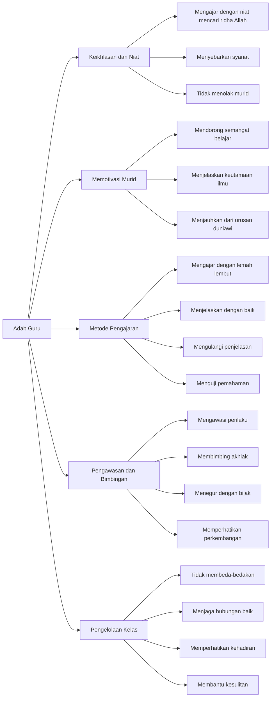

# Adab Guru dalam Pengajaran (Tadzkiratu Sami')

Dokumen ini membahas prinsip-prinsip fundamental tentang adab dan etika seorang guru dalam proses pengajaran. Teks menekankan lima aspek utama: keikhlasan dan niat dalam mengajar, metode memotivasi murid, teknik pengajaran yang efektif, pengawasan dan bimbingan murid, serta pengelolaan kelas yang baik. Pembahasan mencakup pentingnya niat yang tulus dalam mengajar, strategi membangun semangat belajar murid, metode penyampaian yang tepat, cara membimbing perilaku murid, dan teknik mengelola dinamika kelas. Teks ini memberikan panduan komprehensif bagi guru dalam menjalankan tugas pengajaran sesuai dengan prinsip-prinsip pendidikan Islam.

## Diagram

## Tabel

| Level 1                  | Level 2                                  | Level 3 | Keterangan                                 |
|--------------------------|------------------------------------------|---------|--------------------------------------------|
| Keikhlasan dan Niat      | Mengajar dengan niat mencari ridha Allah |         | Fokus pada tujuan pengajaran untuk Allah   |
| Keikhlasan dan Niat      | Menyebarkan syariat                      |         | Menghidupkan kebenaran dan ilmu            |
| Keikhlasan dan Niat      | Tidak menolak murid                      |         | Menerima murid terlepas dari niatnya       |
| Memotivasi Murid         | Mendorong semangat belajar               |         | Memberikan motivasi di berbagai kesempatan |
| Memotivasi Murid         | Menjelaskan keutamaan ilmu               |         | Menyampaikan nilai penting ilmu dan ulama  |
| Memotivasi Murid         | Menjauhkan dari urusan duniawi           |         | Fokus pada pencapaian ilmu                 |
| Metode Pengajaran        | Mengajar dengan lemah lembut             |         | Menyampaikan dengan cara yang baik         |
| Metode Pengajaran        | Menjelaskan dengan baik                  |         | Memastikan pemahaman yang jelas            |
| Metode Pengajaran        | Mengulangi penjelasan                    |         | Mengulang jika diperlukan                  |
| Metode Pengajaran        | Menguji pemahaman                        |         | Memastikan murid memahami materi           |
| Pengawasan dan Bimbingan | Mengawasi perilaku                       |         | Memperhatikan adab murid                   |
| Pengawasan dan Bimbingan | Membimbing akhlak                        |         | Membentuk karakter yang baik               |
| Pengawasan dan Bimbingan | Menegur dengan bijak                     |         | Memberikan teguran yang mendidik           |
| Pengawasan dan Bimbingan | Memperhatikan perkembangan               |         | Mengawasi kemajuan belajar                 |
| Pengelolaan Kelas        | Tidak membeda-bedakan                    |         | Memperlakukan murid secara adil            |
| Pengelolaan Kelas        | Menjaga hubungan baik                    |         | Membangun suasana positif                  |
| Pengelolaan Kelas        | Memperhatikan kehadiran                  |         | Mengawasi aktivitas murid                  |
| Pengelolaan Kelas        | Membantu kesulitan                       |         | Memberikan bantuan yang diperlukan         |

## Adab Guru dalam Pengajaran

Berdasarkan teks yang dianalisis, terdapat lima aspek utama dalam adab guru:

### 1. Keikhlasan dan Niat

Seorang guru harus memiliki niat yang tulus dalam mengajar, ditunjukkan melalui:

- Mengajar dengan tujuan mencari ridha Allah
- Berkomitmen untuk menyebarkan syariat dan menghidupkan kebenaran
- Tidak menolak murid karena pertimbangan niat mereka

### 2. Memotivasi Murid

Guru bertanggung jawab untuk:

- Aktif mendorong semangat belajar murid
- Menjelaskan nilai dan keutamaan ilmu serta ulama
- Membantu murid fokus pada pembelajaran dengan menjauhkan dari urusan duniawi

### 3. Metode Pengajaran

Dalam mengajar, guru harus:

- Menyampaikan ilmu dengan lemah lembut
- Memberikan penjelasan yang baik dan jelas
- Bersedia mengulangi penjelasan saat diperlukan
- Melakukan pengujian untuk memastikan pemahaman

### 4. Pengawasan dan Bimbingan

Guru memiliki tanggung jawab untuk:

- Mengawasi perilaku dan adab murid
- Membimbing pembentukan akhlak
- Memberikan teguran dengan cara yang bijak
- Memantau perkembangan pembelajaran murid

### 5. Pengelolaan Kelas

Dalam mengelola kelas, guru harus:

- Memperlakukan semua murid secara adil tanpa diskriminasi
- Membangun dan menjaga hubungan baik antar murid
- Memperhatikan kehadiran dan aktivitas murid
- Memberikan bantuan saat murid menghadapi kesulitan
