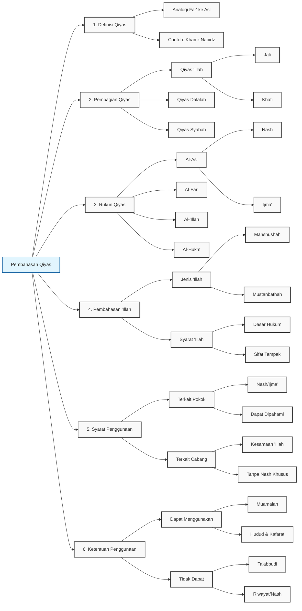

# Mbah Sahal

## Diagram

## Tabel

| Level 1                    | Level 2                               | Level 3      | Keterangan                                                                                         |
|----------------------------|---------------------------------------|--------------|----------------------------------------------------------------------------------------------------|
| 1. Definisi Qiyas          |                                       |              | Menganalogikan cabang (far') dengan pokok (asl) karena kesamaan alasan hukum                       |
| 1. Definisi Qiyas          | Contoh dalam teks                     |              | Khamr sebagai pokok untuk nabi'dz, gandum sebagai pokok untuk beras                                |
| 2. Pembagian Qiyas         |                                       |              |                                                                                                    |
| 2. Pembagian Qiyas         | a) Qiyas 'Illah                       |              | Berdasarkan kesamaan alasan hukum yang jelas                                                       |
| 2. Pembagian Qiyas         | a) Qiyas 'Illah                       | Qiyas Jali   | Contoh: larangan berkata 'ah' kepada orang tua menunjukkan larangan yang lebih keras untuk memukul |
| 2. Pembagian Qiyas         | a) Qiyas 'Illah                       | Qiyas Khafi  | Contoh: larangan jual beli makanan kecuali setara dengan setara                                    |
| 2. Pembagian Qiyas         | b) Qiyas Dalalah                      |              | Contoh: sujud tilawah yang dibolehkan di atas kendaraan, seperti shalat sunnah                     |
| 2. Pembagian Qiyas         | c) Qiyas Syabah                       |              | Contoh: status budak yang mirip orang merdeka (kemanusiaan) dan binatang (kepemilikan)             |
| 3. Rukun Qiyas             |                                       |              |                                                                                                    |
| 3. Rukun Qiyas             | a) Al-Asl (Pokok)                     |              | Kasus asal yang sudah ada hukumnya                                                                 |
| 3. Rukun Qiyas             | a) Al-Asl (Pokok)                     | Sumber       | Nash (Al-Quran/Hadits)                                                                             |
| 3. Rukun Qiyas             | a) Al-Asl (Pokok)                     | Sumber       | Ijma' (kesepakatan ulama)                                                                          |
| 3. Rukun Qiyas             | b) Al-Far' (Cabang)                   |              | Sesuatu yang ditetapkan hukumnya melalui yang lain (ما ثبت حكمه بغيره)                             |
| 3. Rukun Qiyas             | c) Al-'Illah                          |              | ""المعنى الذي يقتضي الحكم"" (makna yang menuntut adanya hukum)                                     |
| 3. Rukun Qiyas             | d) Al-Hukm                            |              | Terkait dengan ""التحليل والتحريم"" (halal dan haram)                                              |
| 4. Pembahasan 'Illah       |                                       |              |                                                                                                    |
| 4. Pembahasan 'Illah       | a) Jenis 'Illah                       | Manshushah   | Tersurat dalam nash                                                                                |
| 4. Pembahasan 'Illah       | a) Jenis 'Illah                       | Mustanbathah | Hasil penggalian/ijtihad                                                                           |
| 4. Pembahasan 'Illah       | b) Syarat 'Illah                      |              | Dapat dijadikan dasar penetapan hukum                                                              |
| 4. Pembahasan 'Illah       | b) Syarat 'Illah                      |              | Bisa berupa sifat yang tampak                                                                      |
| 4. Pembahasan 'Illah       | b) Syarat 'Illah                      |              | Bisa berupa penetapan atau peniadaan                                                               |
| 4. Pembahasan 'Illah       | b) Syarat 'Illah                      |              | Bisa terdiri dari satu atau beberapa sifat                                                         |
| 5. Syarat Penggunaan Qiyas |                                       |              |                                                                                                    |
| 5. Syarat Penggunaan Qiyas | a) Terkait Pokok                      |              | Harus berdasarkan nash atau ijma'                                                                  |
| 5. Syarat Penggunaan Qiyas | a) Terkait Pokok                      |              | Alasan hukumnya harus dapat dipahami                                                               |
| 5. Syarat Penggunaan Qiyas | a) Terkait Pokok                      |              | Hukumnya masih berlaku (tidak mansukh)                                                             |
| 5. Syarat Penggunaan Qiyas | b) Terkait Cabang                     |              | Harus memiliki kesamaan 'illah dengan pokok                                                        |
| 5. Syarat Penggunaan Qiyas | b) Terkait Cabang                     |              | Tidak memiliki nash khusus yang menentukan hukumnya                                                |
| 5. Syarat Penggunaan Qiyas | b) Terkait Cabang                     |              | Tidak mendahului pokok dalam penetapan hukumnya                                                    |
| 6. Ketentuan Penggunaan    |                                       |              |                                                                                                    |
| 6. Ketentuan Penggunaan    | a) Yang Dapat Menggunakan Qiyas       |              | Hukum-hukum syariat yang dapat dipahami alasannya                                                  |
| 6. Ketentuan Penggunaan    | a) Yang Dapat Menggunakan Qiyas       |              | Hukum-hukum muamalah                                                                               |
| 6. Ketentuan Penggunaan    | a) Yang Dapat Menggunakan Qiyas       |              | Masalah hudud dan kafarat                                                                          |
| 6. Ketentuan Penggunaan    | a) Yang Dapat Menggunakan Qiyas       |              | Penetapan ukuran/kadar tertentu                                                                    |
| 6. Ketentuan Penggunaan    | b) Yang Tidak Dapat Menggunakan Qiyas |              | Jumlah rakaat shalat                                                                               |
| 6. Ketentuan Penggunaan    | b) Yang Tidak Dapat Menggunakan Qiyas |              | Waktu puasa                                                                                        |
| 6. Ketentuan Penggunaan    | b) Yang Tidak Dapat Menggunakan Qiyas |              | Ketentuan yang bersifat ta'abbudi                                                                  |
| 6. Ketentuan Penggunaan    | b) Yang Tidak Dapat Menggunakan Qiyas |              | Hal-hal yang hanya dapat diketahui melalui riwayat/nash                                            |

## Pembahasan Qiyas dalam Hukum Islam

### 1. Pengertian Qiyas

Qiyas adalah metode penetapan hukum Islam dengan cara menganalogikan suatu kasus baru (far') dengan kasus yang telah memiliki ketetapan hukum (asl) karena adanya kesamaan alasan hukum ('illah). Dalam teks klasik, dijelaskan contoh seperti penganalogian nabidz dengan khamr, atau beras dengan gandum dalam konteks tertentu.

### 2. Klasifikasi Qiyas

#### a. Qiyas 'Illah

Merupakan analogi yang didasarkan pada kesamaan alasan hukum yang jelas. Terbagi menjadi dua:

- **Qiyas Jali**: Analogi dengan alasan hukum yang sangat jelas, seperti dalam kasus larangan berkata "ah" kepada orang tua yang menunjukkan larangan yang lebih berat untuk tindakan yang lebih kasar

- **Qiyas Khafi**: Analogi dengan alasan hukum yang lebih samar, seperti dalam kasus larangan jual beli makanan kecuali dengan takaran yang setara

#### b. Qiyas Dalalah

Analogi yang didasarkan pada petunjuk hukum, bukan pada alasan hukum secara langsung. Contohnya adalah kebolehan melakukan sujud tilawah di atas kendaraan, dianalogikan dengan kebolehan shalat sunnah di atas kendaraan.

#### c. Qiyas Syabah

Analogi yang didasarkan pada kemiripan antara dua hal. Seperti status hukum budak yang memiliki kemiripan dengan manusia merdeka dalam aspek kemanusiaan, dan dengan hewan dalam aspek kepemilikan.

### 3. Rukun-rukun Qiyas

Qiyas memiliki empat rukun utama:

#### a. Al-Asl (Pokok)

- Merupakan kasus asal yang telah memiliki ketetapan hukum
- Harus bersumber dari nash (Al-Quran/Hadits) atau ijma'
- Hukumnya harus masih berlaku

#### b. Al-Far' (Cabang)

- Kasus baru yang hendak ditetapkan hukumnya
- Dalam teks Arab disebutkan sebagai "ما ثبت حكمه بغيره" (sesuatu yang ditetapkan hukumnya melalui yang lain)

#### c. Al-'Illah (Alasan Hukum)

- Sifat yang menjadi dasar penetapan hukum
- Didefinisikan sebagai "المعنى الذي يقتضي الحكم" (makna yang menuntut adanya hukum)

#### d. Al-Hukm (Ketentuan Hukum)

- Hukum yang akan ditetapkan
- Berkaitan dengan "التحليل والتحريم" (halal dan haram)

### 4. Kajian tentang 'Illah

#### a. Jenis 'Illah

1. **Manshushah**: 'Illah yang disebutkan secara eksplisit dalam nash
2. **Mustanbathah**: 'Illah yang digali melalui ijtihad

#### b. Syarat 'Illah

- Dapat dijadikan dasar penetapan hukum
- Merupakan sifat yang dapat diamati
- Dapat berupa penetapan atau peniadaan
- Bisa terdiri dari satu atau beberapa sifat

### 5. Persyaratan Penggunaan Qiyas

#### a. Syarat Terkait Pokok (Asl)

- Harus berdasarkan nash atau ijma'
- Alasan hukumnya harus dapat dipahami
- Hukumnya masih berlaku (tidak mansukh)

#### b. Syarat Terkait Cabang (Far')

- Harus memiliki kesamaan 'illah dengan pokok
- Tidak memiliki nash khusus yang menentukan hukumnya
- Tidak mendahului pokok dalam penetapan hukumnya

### 6. Ruang Lingkup Penggunaan Qiyas

#### a. Dapat Menggunakan Qiyas

- Hukum-hukum syariat yang dapat dipahami alasannya
- Hukum-hukum muamalah
- Masalah hudud dan kafarat
- Penetapan ukuran/kadar tertentu

#### b. Tidak Dapat Menggunakan Qiyas

- Jumlah rakaat shalat
- Waktu puasa
- Ketentuan yang bersifat ta'abbudi (murni ibadah)
- Hal-hal yang hanya dapat diketahui melalui riwayat/nash
