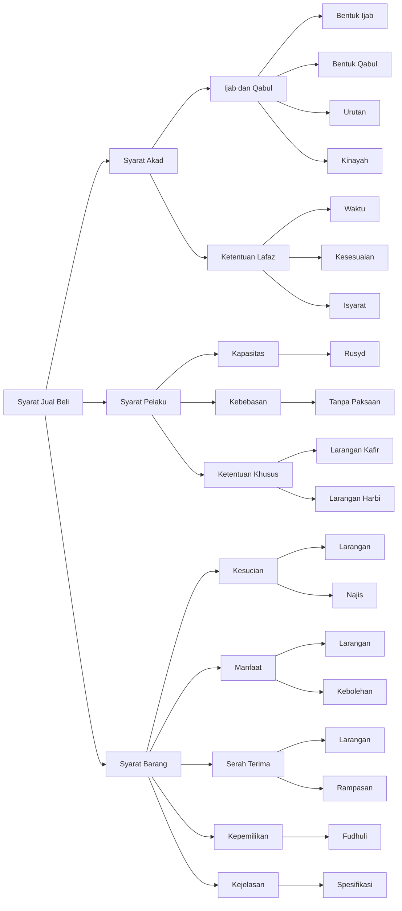

# Minhaj Jual Beli

## Diagram

## Tabel

| Level 1       | Level 2          | Level 3        | Keterangan                                                    |
|---------------|------------------|----------------|---------------------------------------------------------------|
| Syarat Akad   | Ijab dan Qabul   | Bentuk Ijab    | bi'tuka dan mallaktuka                                        |
| Syarat Akad   | Ijab dan Qabul   | Bentuk Qabul   | isytaraitu tamallaktu dan qabiltu                             |
| Syarat Akad   | Ijab dan Qabul   | Urutan         | Boleh mendahulukan lafaz pembeli                              |
| Syarat Akad   | Ijab dan Qabul   | Kinayah        | Sah menggunakan kiasan                                        |
| Syarat Akad   | Ketentuan Lafaz  | Waktu          | Tidak boleh ada jeda panjang                                  |
| Syarat Akad   | Ketentuan Lafaz  | Kesesuaian     | Qabul harus sesuai ijab                                       |
| Syarat Akad   | Ketentuan Lafaz  | Isyarat        | Isyarat orang bisu sama seperti ucapan                        |
| Syarat Pelaku | Kapasitas        | Rusyd          | Harus cakap hukum                                             |
| Syarat Pelaku | Kebebasan        | Tanpa Paksaan  | Tidak ada paksaan tanpa hak                                   |
| Syarat Pelaku | Ketentuan Khusus | Larangan Kafir | Tidak boleh membeli mushaf dan muslim                         |
| Syarat Pelaku | Ketentuan Khusus | Larangan Harbi | Tidak boleh membeli senjata                                   |
| Syarat Barang | Kesucian         | Larangan       | Tidak sah menjual anjing dan khamar                           |
| Syarat Barang | Kesucian         | Najis          | Tidak sah menjual barang najis yang tidak bisa disucikan      |
| Syarat Barang | Manfaat          | Larangan       | Tidak sah menjual serangga dan binatang buas tidak bermanfaat |
| Syarat Barang | Manfaat          | Kebolehan      | Boleh menjual air di tepi sungai dan tanah di padang          |
| Syarat Barang | Serah Terima     | Larangan       | Tidak sah menjual barang hilang dan budak kabur               |
| Syarat Barang | Serah Terima     | Rampasan       | Tidak sah menjual barang yang dirampas                        |
| Syarat Barang | Kepemilikan      | Fudhuli        | Penjualan tanpa izin pemilik batal                            |
| Syarat Barang | Kejelasan        | Spesifikasi    | Harus jelas dan spesifik                                      |

## Syarat-syarat Jual Beli dalam Kitab Minhaj al-Thalibin

Dalam kitab Minhaj al-Thalibin, syarat-syarat jual beli dapat dibagi menjadi tiga kategori utama: syarat akad, syarat pelaku, dan syarat barang.

### Syarat Akad

Syarat akad terdiri dari dua komponen utama: ijab-qabul dan ketentuan lafaz. Dalam ijab-qabul, terdapat bentuk-bentuk khusus seperti "bi'tuka" dan "mallaktuka" untuk ijab, serta "isytaraitu", "tamallaktu", dan "qabiltu" untuk qabul. Urutan pengucapan boleh didahulukan oleh pembeli, dan penggunaan kinayah (kiasan) diperbolehkan. Untuk ketentuan lafaz, tidak boleh ada jeda panjang antara ijab dan qabul, qabul harus sesuai dengan ijab, dan isyarat orang bisu dianggap sama seperti ucapan.

### Syarat Pelaku

Pelaku akad harus memenuhi syarat kapasitas berupa rusyd (cakap hukum) dan kebebasan berupa tidak adanya paksaan tanpa hak. Terdapat ketentuan khusus berupa larangan bagi orang kafir untuk membeli mushaf dan muslim, serta larangan bagi kafir harbi untuk membeli senjata.

### Syarat Barang

Barang yang diperjualbelikan harus memenuhi lima syarat utama:

1. Kesucian: tidak boleh menjual anjing, khamar, dan barang najis yang tidak dapat disucikan

2. Manfaat: tidak boleh menjual serangga dan binatang buas yang tidak bermanfaat, namun boleh menjual air di tepi sungai dan tanah di padang

3. Serah terima: tidak boleh menjual barang hilang, budak yang kabur, dan barang yang dirampas

4. Kepemilikan: penjualan fudhuli (tanpa izin pemilik) dianggap batal

5. Kejelasan: barang harus diketahui dengan jelas dan spesifik
