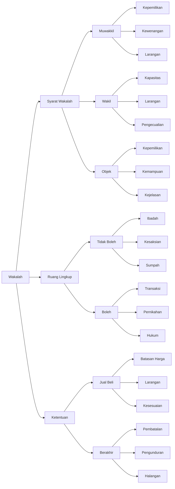

# Minhaj Wakalah

## Diagram

## Tabel

| Level 1        | Level 2     | Level 3       | Keterangan                               |
|----------------|-------------|---------------|------------------------------------------|
| Syarat Wakalah | Muwakkil    | Kepemilikan   | Memiliki hak tindakan yang diwakilkan    |
| Syarat Wakalah | Muwakkil    | Kewenangan    | Memiliki otoritas untuk mewakilkan       |
| Syarat Wakalah | Muwakkil    | Larangan      | Tidak sah dari anak kecil dan orang gila |
| Syarat Wakalah | Wakil       | Kapasitas     | Mampu bertindak untuk dirinya sendiri    |
| Syarat Wakalah | Wakil       | Larangan      | Bukan anak kecil atau orang gila         |
| Syarat Wakalah | Wakil       | Pengecualian  | Hamba sahaya boleh terima nikah          |
| Syarat Wakalah | Objek       | Kepemilikan   | Harus dimiliki pemberi kuasa             |
| Syarat Wakalah | Objek       | Kemampuan     | Bisa diwakilkan                          |
| Syarat Wakalah | Objek       | Kejelasan     | Harus diketahui dengan jelas             |
| Ruang Lingkup  | Tidak Boleh | Ibadah        | Kecuali haji zakat kurban                |
| Ruang Lingkup  | Tidak Boleh | Kesaksian     | Tidak bisa diwakilkan                    |
| Ruang Lingkup  | Tidak Boleh | Sumpah        | Tidak bisa diwakilkan                    |
| Ruang Lingkup  | Boleh       | Transaksi     | Jual beli dan hibah                      |
| Ruang Lingkup  | Boleh       | Pernikahan    | Nikah dan talak                          |
| Ruang Lingkup  | Boleh       | Hukum         | Penagihan hutang dan gugatan             |
| Ketentuan      | Jual Beli   | Batasan Harga | Sesuai kebiasaan                         |
| Ketentuan      | Jual Beli   | Larangan      | Tidak boleh ke diri sendiri              |
| Ketentuan      | Jual Beli   | Kesesuaian    | Harus sesuai syarat yang ditetapkan      |
| Ketentuan      | Berakhir    | Pembatalan    | Dari pemberi kuasa                       |
| Ketentuan      | Berakhir    | Pengunduran   | Dari wakil                               |
| Ketentuan      | Berakhir    | Halangan      | Kematian atau hilang akal                |

## Konsep Wakalah dalam Kitab Minhaj al-Thalibin

### Syarat-syarat Wakalah

#### 1. Syarat Muwakkil (Pemberi Kuasa)

Pemberi kuasa harus memenuhi syarat:

- Memiliki hak untuk melakukan tindakan yang diwakilkan
- Memiliki kewenangan untuk mewakilkan
- Tidak sah dari anak kecil dan orang gila

#### 2. Syarat Wakil (Penerima Kuasa)

Penerima kuasa harus memenuhi kriteria:

- Mampu melakukan tindakan untuk dirinya sendiri
- Bukan anak kecil atau orang gila
- Khusus untuk hamba sahaya, boleh menerima perwakilan dalam nikah

#### 3. Syarat Objek Wakalah

Objek yang diwakilkan harus:

- Dimiliki oleh pemberi kuasa
- Dapat diwakilkan
- Diketahui dengan jelas

### Ruang Lingkup Wakalah

#### 1. Yang Tidak Boleh Diwakilkan

Beberapa hal yang tidak boleh diwakilkan:

- Ibadah (kecuali haji, zakat, kurban)
- Kesaksian
- Sumpah

#### 2. Yang Boleh Diwakilkan

Hal-hal yang boleh diwakilkan:

- Transaksi seperti jual beli dan hibah
- Pernikahan dan talak
- Urusan hukum seperti penagihan hutang dan gugatan

### Ketentuan Pelaksanaan

#### 1. Ketentuan dalam Jual Beli

Wakil dalam jual beli harus memperhatikan:

- Batasan harga sesuai kebiasaan
- Larangan menjual kepada diri sendiri
- Kesesuaian dengan syarat yang ditetapkan

#### 2. Berakhirnya Wakalah

Wakalah dapat berakhir karena:

- Pembatalan dari pemberi kuasa
- Pengunduran diri wakil
- Halangan seperti kematian atau hilang akal
