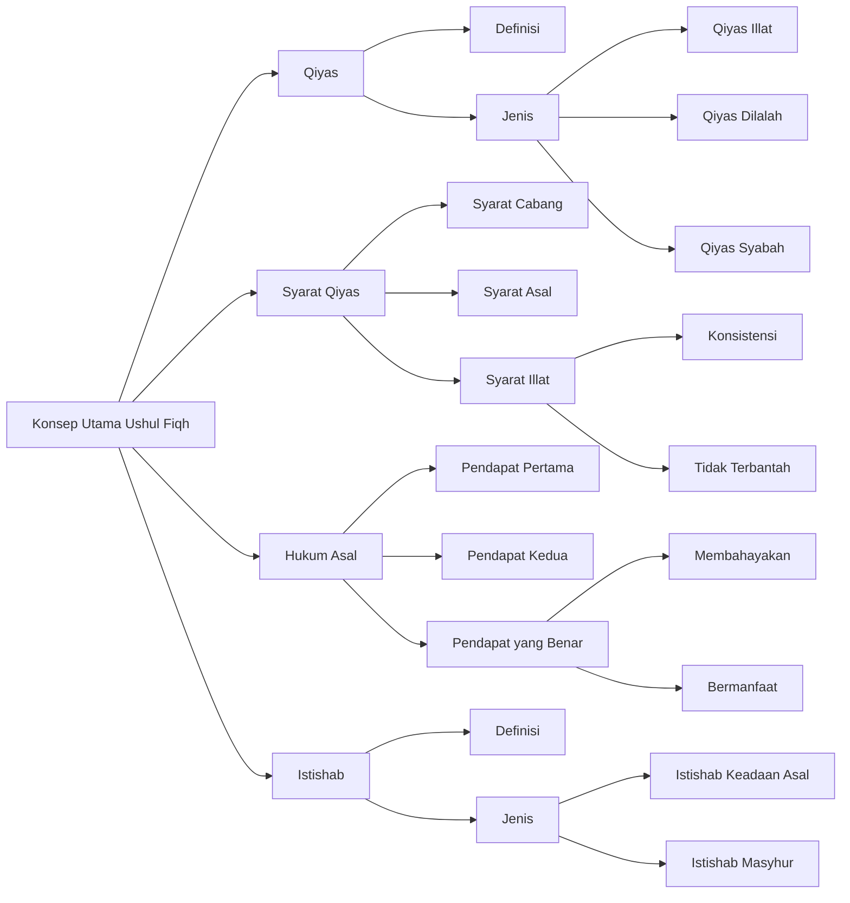

# Konsep Qiyas dalam Ushul Fiqh (Syarah Waraqat)

Dokumen ini mengkaji konsep qiyas (analogi hukum) dalam metodologi hukum Islam. Pembahasan mencakup definisi qiyas, tiga jenis qiyas (illat, dilalah, dan syabah), syarat-syarat penerapannya, serta konsep hukum asal (hazar dan ibahah) dan istishab. Teks ini menjelaskan bagaimana menggunakan qiyas sebagai metode penetapan hukum, dengan memperhatikan syarat-syarat yang ketat baik dari segi cabang (far'), asal, maupun illat (alasan hukum). Pembahasan juga mencakup perdebatan tentang status hukum asal sesuatu dan konsep keberlanjutan hukum (istishab) dalam metodologi hukum Islam.

## Diagram

## Tabel

| Level 1      | Level 2             | Level 3               | Keterangan                                                                         |
|--------------|---------------------|-----------------------|------------------------------------------------------------------------------------|
| Qiyas        | Definisi            |                       | Mengembalikan cabang ke asal karena ada illat yang menyatukan keduanya dalam hukum |
| Qiyas        | Jenis               | Qiyas Illat           | Illat yang mewajibkan hukum                                                        |
| Qiyas        | Jenis               | Qiyas Dilalah         | Pengambilan dalil dari salah satu yang serupa kepada yang lain                     |
| Qiyas        | Jenis               | Qiyas Syabah          | Cabang yang berada di antara dua asal diikutkan kepada yang lebih mirip            |
| Syarat Qiyas | Syarat Cabang       |                       | Harus sesuai dengan asal dalam hal yang menyatukannya                              |
| Syarat Qiyas | Syarat Asal         |                       | Hukumnya harus tetap dengan dalil yang disepakati                                  |
| Syarat Qiyas | Syarat Illat        | Konsistensi           | Harus konsisten dalam hal-hal yang diillati                                        |
| Syarat Qiyas | Syarat Illat        | Tidak Terbantah       | Tidak boleh terbantah secara lafaz maupun makna                                    |
| Hukum Asal   | Pendapat Pertama    |                       | Asal segala sesuatu adalah terlarang                                               |
| Hukum Asal   | Pendapat Kedua      |                       | Asal segala sesuatu adalah boleh                                                   |
| Hukum Asal   | Pendapat yang Benar | Membahayakan          | Yang membahayakan hukumnya haram                                                   |
| Hukum Asal   | Pendapat yang Benar | Bermanfaat            | Yang bermanfaat hukumnya halal                                                     |
| Istishab     | Definisi            |                       | Memberlakukan hukum asal ketika tidak ada dalil syar'i                             |
| Istishab     | Jenis               | Istishab Keadaan Asal | Pasti menjadi hujjah                                                               |
| Istishab     | Jenis               | Istishab Masyhur      | Berlakunya suatu perkara di waktu kedua karena berlakunya di waktu pertama         |

## Konsep-Konsep Utama dalam Ushul Fiqh

### 1. Qiyas (Analogi Hukum)

Qiyas didefinisikan sebagai mengembalikan cabang ke asal karena adanya illat yang menyatukan keduanya dalam hukum. Terdapat tiga jenis qiyas:

#### a. Qiyas Illat

- Merupakan qiyas dimana illat mewajibkan hukum
- Berlaku ketika ada illat yang jelas

#### b. Qiyas Dilalah

- Pengambilan dalil dari salah satu yang serupa kepada yang lain
- Illat menjadi penunjuk hukum, bukan yang mewajibkan

#### c. Qiyas Syabah

- Cabang yang berada di antara dua asal
- Diikutkan kepada yang lebih mirip di antara keduanya

### 2. Syarat-Syarat Qiyas

Terdapat beberapa syarat yang harus dipenuhi dalam qiyas:

#### a. Syarat Cabang (Far')

- Harus sesuai dengan asal dalam hal yang menyatukannya
- Memiliki kesesuaian dengan hukum asal

#### b. Syarat Asal

- Hukumnya harus tetap dengan dalil yang disepakati
- Menjadi dasar perbandingan yang valid

#### c. Syarat Illat

- Harus konsisten dalam hal-hal yang diillati
- Tidak boleh terbantah secara lafaz maupun makna

### 3. Hukum Asal (Hazar dan Ibahah)

Terdapat tiga pendapat mengenai hukum asal:

#### a. Pendapat Pertama

- Asal segala sesuatu adalah terlarang
- Kecuali yang dibolehkan oleh syariat

#### b. Pendapat Kedua

- Asal segala sesuatu adalah boleh
- Kecuali yang dilarang oleh syariat

#### c. Pendapat yang Benar (Perincian)

- Yang membahayakan hukumnya haram
- Yang bermanfaat hukumnya halal

### 4. Istishab

Konsep keberlanjutan hukum dalam ushul fiqh:

#### a. Definisi

- Memberlakukan hukum asal ketika tidak ada dalil syar'i
- Berlaku ketika tidak ditemukan dalil yang mengubah hukum

#### b. Jenis-jenis

1. Istishab Keadaan Asal
   - Pasti menjadi hujjah
   - Berlaku ketika tidak ada perubahan

2. Istishab Masyhur
   - Berlakunya suatu perkara di waktu kedua karena berlakunya di waktu pertama
   - Ada perbedaan pendapat dalam penggunaannya
